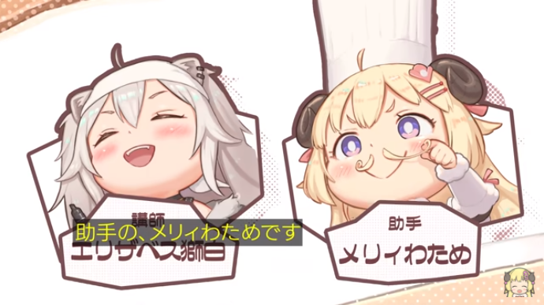

# 【ここ好きまとめ】ししわたクッキング

<iframe width="560" height="315" src="https://www.youtube.com/embed/fsPSaFbonGo" title="YouTube video player" frameborder="0" allow="accelerometer; autoplay; clipboard-write; encrypted-media; gyroscope; picture-in-picture" allowfullscreen></iframe>

[わためぇ2周年記念ライブ](https://www.youtube.com/watch?v=TV8rLERH6yU)の中で、
ししわたのオリジナル曲『[ししわたクッキング](https://www.youtube.com/watch?v=fsPSaFbonGo)』が
公開されましたね。

1回聴いて惚れてしまったので、それについて語りたいだけのエントリです。

オタクモード全開の
誰得エントリー。

ちなみに、CP名はいつも悩む。
『ししわた』とか『ししトワ』安定なんだけど、
「いやわためもトワ様も先輩なのに、「しし」の後ろにつけていいものだろうか、と。

ルパンとコナンでも、どっちを先につけるか揉めたって聞くし。

まあでも、関係ないのでスキップ。

## ししろフーズ調理学校

内輪ネタのししろフーズが出てきて嬉しい。
それに、ししろフーズはいろいろなことに手を出している(内輪ネタ)とういうことなので、
「調理学校まで作ったんかい！ｗｗ」というおかしみがあって好き。

## エリザベス獅白 / メリィわため

絶妙なダサさがすごく好き。

一歩間違えばdisりに聞こえそうだけど、そんなつもりは毛頭ないです。
むしろリスペクトです。

どちらかというと、ししろんは笑いに貪欲というか、笑わせたる、というサービス精神が旺盛だと個人的に思ってます。

なので、この絶妙なダサさも「なんぞｗｗ」と視聴者に思わせるためのダサさだと思うんですよ。

で。かっこよくも絶望的にダサくもない、ちょうど笑いを誘う「ダサさ」がにじみ出てて、
面白くて、めっちゃ好き。

あと、『メリィわため』は『メリーさんのひつじ』にかかってて、ミーニングの妙がある。

逆に『エリザベス獅白』は、講師とエリザベスが全く関係ないし、
なんか『エリザベス』って偉そう(エリザベス１世)でヒステリーそう(偏見)だし、
なんなら銀魂の『エリザベス』がふと脳裏をよぎって、もうそれだけで面白い！

## 氵羊食料理

配信中ししろんも言ってた気がするけど、
さんずい（シ）はししろん/ししろフーズのことで、
これを取ったら「羊食料理」になるってネタ。

すごくクレバーで、めっちゃ好き。

## メイラード反応ってめっちゃ美味しいよね(羊肉)

お肉のそぼろってあるじゃないですか？

あれって、フライパンにひき肉を入れて炒めるんですが、
入れた直後から炒めちゃいけないんですよ。

ひき肉を入れたらしばらくほっておいて、少し焼き目をつけるんです。

焼き目がついてきたら、軽くひっくり返して、また焼き目をつける。

全体的に焼き目がついてから、ポロポロになるまで炒めるんです。

なぜはじめに焼き目をつけるのかというと、メイラード反応を起こすためです。

詳しくはwikiを見てくれですが、このメイラード反応によって、
お肉の旨味がギュッと詰まった美味しいそぼろができあがるんです。

みなさん、よく見てください。

わためは火傷をしており、バッチリとメイラード反応を起こしています。

つまり、このわための手は、旨味がギュッと詰まっっているということです。

これは、ししろんもよだれが出ちゃうのも頷けますね（ニッコリ）

<!-- 
## aim関係ねーｗ

## poi
-->

## 「飛ぶぞ！つけたらわかる」

ちょいちょい出てくるネットミームが、もう好きすぎで……

元ネタは相席食堂。

長州力さんがホタテを勧めて「食ってみな。飛ぶぞ」といったとこ。

## ステンバーイ

「ステンバーイ…」も内輪ネタ。もとはCoD4のマクミラン大佐の[セリフ](https://dic.pixiv.net/a/%EF%BD%BD%EF%BE%83%EF%BE%9D%EF%BE%8A%EF%BE%9E%EF%BD%B0%EF%BD%B2)。

これもネットミームかな？

今では、配信開始直前から「ららー」ってコメントで溢れてるけど、
昔は「待機」→「ステンバーイ…」→「ららー」だった気がする。

記憶違いかもしれないけど。

## 背後のピコピコ音

チップチューンていうのか8bitsチューンというのかわからないですが、
こういうピコピコ音が好き。

使い方は全く違うけど、ピコピコ音の大御所は、勝手にsasakure. UKさんだと思ってる。

関係ないけど。

## アマゾンネタ

これもネットミーム。

完全に他のホロリスさんのところを知らなくて恐縮だけど、
アマゾンネタはししろん配信でよく出てくる。

係長が知ってる最も古いアマゾン探検隊は、モーリーオンラインのクレーンゲーム会だったと思う。

ちなみにアマゾンネタは(そこそこ)頻出なので、
アマゾン探検するSSRBを描いたのがこちら(関係ない)

あと、何気に、AK(?ライフル)を持ってるのが好き。

「料理学校の講師だよね？　なんでライフル持ってるの？」って感じで好き。

あと持ち方が凄くリアル。

あとわため、なにげに草食べてるし。
おなかすいちゃったのかな？

## SSRB(俺ら)カメオ出演

すっごく嬉しい！嬉しすぎて爆発するかと思った。

あと、ナンバープレートの『446 > 22』の意味がわからなかった…(悔しい)。

「ししろ　から　22」の22がわからない…

「角巻」も「わため」も「羊」も「肉」も「ドドド」も22にならんと思うのですよ…
なんだろう、この「22」

SSWT(ししわた)、こういう細かいとこ好き。

あと、FPSだと大体乗り物乗るよね。

だから素材集めで、ししろんドライバーのジープ乗り回してるんだね。

## ガンギマリらいおんとガンギマリひつじ

「いや、角巻じゃんけんで獲物仕留めるんかーい！」は、SSRB/ワタメイト関係なくみんなツッコミしたと思う。うん。

## なんとかしてくれるししろぼたん

これも内輪ネタで、すごく嬉しい…

もともとは、ねぽらぼマイクラコラボでマイクラバグったねねちを、
ししろんが会話だけで(「Alt+F4で終了できない？」)で解決してしまったことに端を発する。

もともとPCつよつよライオン（自作勢/Corei9 10900K + RTX3090というBeefPC)ということもあり、
ここから、「なんとかしてくれる　獅白ぼたん」というミームが誕生した。

<iframe width="560" height="315" src="https://www.youtube.com/embed/82UUpnlE5kc" title="YouTube video player" frameborder="0" allow="accelerometer; autoplay; clipboard-write; encrypted-media; gyroscope; picture-in-picture" allowfullscreen></iframe>

そして、おまるんが、キッコーマンのCMをオマージュして、
「なんとかしてくれる　獅白ぼたん♪」という動画を作って、ミームが広がった(と思う）。

<iframe width="360" height="202" src="https://www.youtube.com/embed/rJIzEyr1xMM" title="YouTube video player" frameborder="0" allow="accelerometer; autoplay; clipboard-write; encrypted-media; gyroscope; picture-in-picture" allowfullscreen></iframe>

<iframe width="360" height="202" src="https://www.youtube.com/embed/4BDNx051GkI" title="YouTube video player" frameborder="0" allow="accelerometer; autoplay; clipboard-write; encrypted-media; gyroscope; picture-in-picture" allowfullscreen></iframe>

余談だけど、いつかのスパチャお礼枠で「サトームセン」も同じメロディのため混同されてることがわかったりもした。

## ししわたてぇてぇ。ほんとてぇてぇ

てかもう、食べちゃってんだよなぁ…

## わためとエンゲージしたししろん(イケメン)

ししろんがイケメンでイケメンで、もうね。

潔くかっこよく生きて行っちゃってるんですよ。

これでたまに、モテない男ムーブ（ネタ）をするんですよ、信じられますか？（好き）

## そもそも「ししわたクッキング」

<iframe width="560" height="315" src="https://www.youtube.com/embed/ypv58k8ux-Y" title="YouTube video player" frameborder="0" allow="accelerometer; autoplay; clipboard-write; encrypted-media; gyroscope; picture-in-picture" allowfullscreen></iframe>

ししろんがよくわためを食べようとしてるから、「ししわたクッキング」という解釈もできるけど、
そもそも、ししろんの(ねぽらぼ以外の)初コラボ相手がわためで、遊んだゲームが「クッキングシミュレータ」だった。

その、ししわたの歴史の本当に第一歩をオマージュしてると思うと、てぇてぇが更に加速してしまう。

 
 

あと、すっげー関係ないけど、

「明日の素材は、新鮮なラム肉料理」らしいけど、明後日の助手は誰なんだろうって思ったら、

『マダム・フィグスの宇宙お料理教室』（５分間SF/草上仁）

を思い出した。

